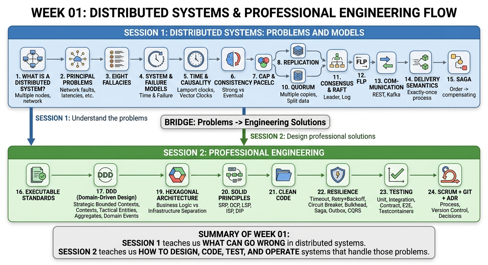

<!-- HU-STATUS TEMPLATE - do NOT remove the <!-- ... --> markers or the table headers.
     Your weekly grade is read AUTOMATICALLY from this file:
       01-week/hu-status/README.md  (inside YOUR fork). English. -->

# Weekly Status - Week 01

<!-- CONFIG-START - must match your profile repo (username/username) CONFIG -->
- FULL_NAME: Maria Celeste Dussan
- GITHUB_USER: CelesteDussan
- TEAM: G1
- SPRINT_GOAL: Define and organize the initial architecture, responsibilities, and development plan for the EduTrack distributed system.
<!-- CONFIG-END -->

## 1. User stories worked this week

| HU ID | Title | Status (todo/doing/done) | Evidence (PR or commit URL) |
|---|---|---|---|
| HU-003 | View progress of multiple children | doing | Pending commit |
| HU-001 | View grades in near real time | todo | Pending implementation |
| HU-002 | Absence alert without duplicates | todo | Pending implementation |
| HU-004 | Direct communication with teachers | todo | Pending implementation |
| HU-005 | Attendance registration with causal ordering | todo | Pending implementation |

## 2. My individual contribution

- Contributed to the initial planning and organization of the EduTrack distributed system.
- Defined a complementary project design focused on dividing responsibilities among team members.
- Organized the system into five main modules: Identity/Accounts, Academic Records, Attendance, Notifications, and Communication.
- Defined the main responsibilities and minimum deliverables for each module.
- Proposed synchronous communication using REST APIs and asynchronous communication using events.
- Defined initial distributed event flows for grades and student absences.
- Proposed a simplified hexagonal architecture structure for each module.
- Defined a Git workflow based on feature branches and Pull Requests.
- Identified idempotency, Retry, Outbox, and event-driven communication as important mechanisms for the MVP.

## 3. Blockers and risks

- Module contracts and event structures still need to be agreed upon by the team.
- The final technology for asynchronous messaging has not yet been defined.
- Integration between independently developed modules may generate conflicts if contracts change.
- Distributed patterns such as Outbox and idempotency still require implementation and testing.

## 4. Plan for next week

- Confirm the responsibility assigned to each team member.
- Define API and event contracts between modules.
- Create the initial project structure following hexagonal architecture.
- Start implementing the assigned user story.
- Add unit tests for the first domain rules.
- Create the corresponding HU branch and Pull Request.
- Validate communication between the first integrated modules.

## 5. Compliance self-check

- [ ] Conventional Commits - `type(scope): summary`
- [ ] Per-environment HU branch + PR to that environment (hu-xxx-dev -> develop, ...)
- [ ] Testable acceptance criteria
- [ ] Tests added/updated (unit / integration)
- [x] DDD / hexagonal boundaries respected (domain has no I/O)
- [x] No secrets; config via environment variables

## 6. Evidence links

- EduTrack PRD: Pending repository link
- EduTrack Project Design and Responsibilities (PDR): Pending repository link
- Week 01 commit: Pending commit URL

## 7. Week 01 Diagram

The following diagram summarizes the main concepts studied during Week 01 about distributed systems and professional engineering practices.

