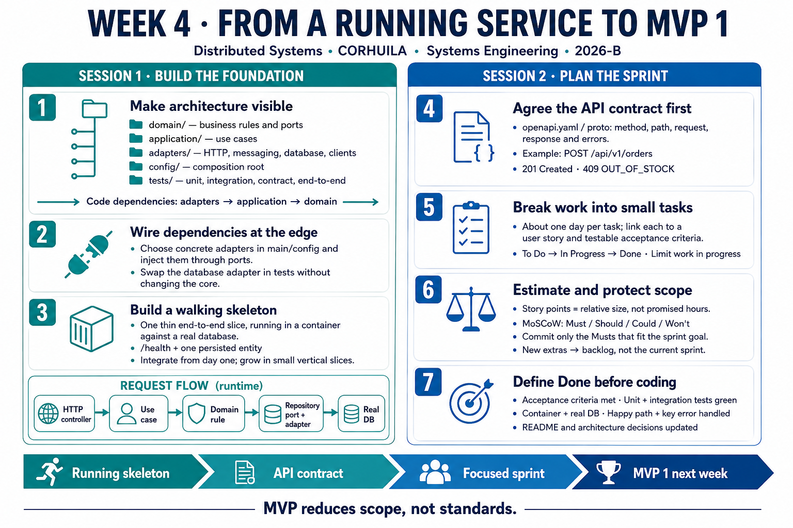

<!-- HU-STATUS TEMPLATE - do NOT remove the <!-- ... --> markers or the table headers.
     Your weekly grade is read AUTOMATICALLY from this file:
       04-week/hu-status/README.md  (inside YOUR fork). English. -->

# Weekly Status - Week 04

<!-- CONFIG-START - must match your profile repo (username/username) CONFIG -->
- FULL_NAME:
- GITHUB_USER:
- TEAM:
- SPRINT_GOAL:
<!-- CONFIG-END -->

## 1. User stories worked this week
| HU ID | Title | Status (todo/doing/done) | Evidence (PR or commit URL) |
|---|---|---|---|
| HU-XXX-001 |  |  |  |

## 2. My individual contribution
-

## 3. Blockers and risks
-

## 4. Plan for next week
-

## 5. Compliance self-check
- [ ] Conventional Commits - `type(scope): summary`
- [ ] Per-environment HU branch + PR to that environment (hu-xxx-dev -> develop, ...)
- [ ] Testable acceptance criteria
- [ ] Tests added/updated (unit / integration)
- [ ] DDD / hexagonal boundaries respected (domain has no I/O)
- [ ] No secrets; config via environment variables

## 6. Evidence links
-

## 7. Week 4 learning summary — Sessions 1 and 2

Session 1 establishes a runnable foundation: organize domain, application and adapters; inject dependencies at the composition root; and integrate a thin end-to-end slice with a real database from day one. Session 2 plans MVP 1 on that foundation: agree the API contract before implementing its endpoints, split stories into small verifiable tasks, estimate relative size, commit only the Musts that fit the sprint goal, and agree a release-grade Definition of Done.

**Key takeaway:** MVP reduces scope, not standards. This image summarizes the course sessions; it does not claim that implementation tasks or tests have been completed.
