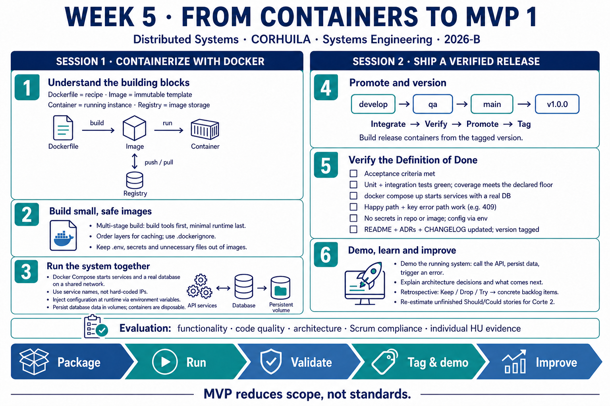
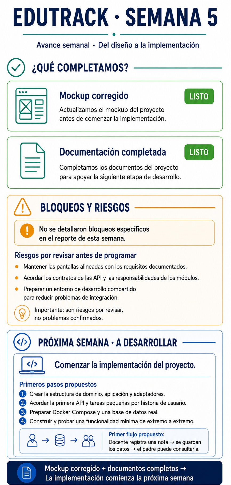

<!-- HU-STATUS TEMPLATE - do NOT remove the <!-- ... --> markers or the table headers.
     Your weekly grade is read AUTOMATICALLY from this file:
       05-week/hu-status/README.md  (inside YOUR fork). English. -->

# Weekly Status - Week 05

<!-- CONFIG-START - must match your profile repo (username/username) CONFIG -->
- FULL_NAME:
- GITHUB_USER:
- TEAM:
- SPRINT_GOAL:
<!-- CONFIG-END -->

## 1. User stories worked this week
| HU ID | Title | Status (todo/doing/done) | Evidence (PR or commit URL) |
|---|---|---|---|
| HU-XXX-001 |  |  |  |

## 2. My individual contribution
-

## 3. Blockers and risks
-

## 4. Plan for next week
-

## 5. Compliance self-check
- [ ] Conventional Commits - `type(scope): summary`
- [ ] Per-environment HU branch + PR to that environment (hu-xxx-dev -> develop, ...)
- [ ] Testable acceptance criteria
- [ ] Tests added/updated (unit / integration)
- [ ] DDD / hexagonal boundaries respected (domain has no I/O)
- [ ] No secrets; config via environment variables

## 6. Evidence links
-

## 7. Week 5 learning summary — Sessions 1 and 2

**Session 1 — Containerization with Docker:** a Dockerfile builds an image, a container runs that image, and a registry stores images for distribution. Multi-stage builds and .dockerignore keep images small and clean. Docker Compose connects services and a real database using service names; configuration is supplied at runtime and persistent data belongs in volumes.

**Session 2 — Shipping MVP 1:** promote the increment through develop, qa and main, then tag the release. Verify acceptance criteria, unit and integration tests, coverage, startup against a real database, the happy path and a key error path, configuration safety and documentation. Demo working software, then turn retrospective improvements and re-estimated unfinished stories into the next backlog.

**Key takeaway:** MVP reduces scope, not standards. This is a learning summary of both sessions, not a claim that the project has completed these release requirements.

## 8. EduTrack weekly project progress

The project update reports that the mockup was corrected and the documentation completed. Implementation is planned to start next week. Specific blockers were not detailed; the image separates forward-looking risks and proposed technical steps from completed work.
