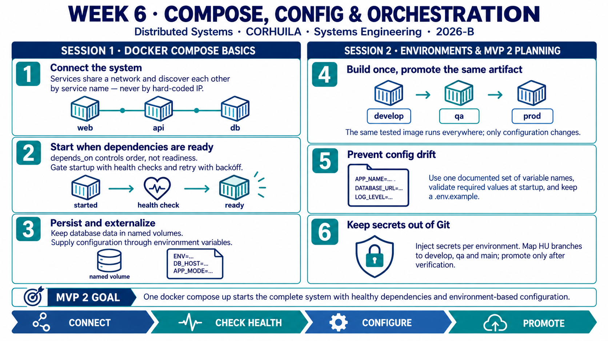
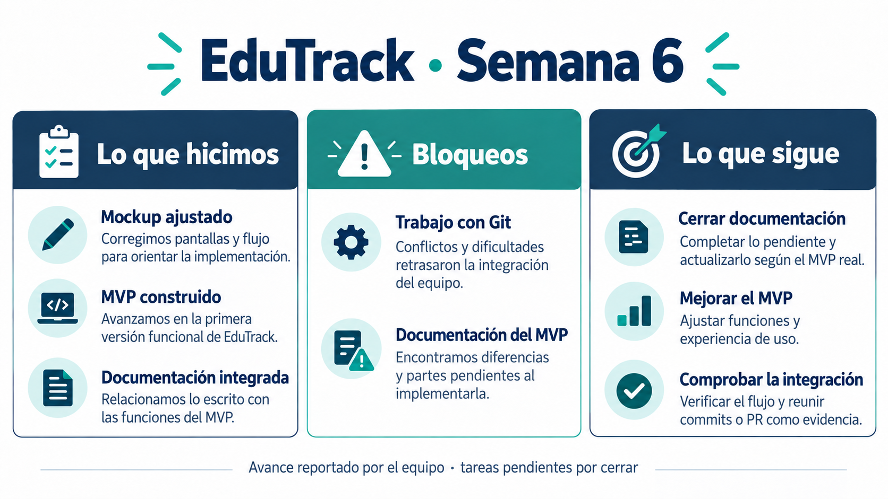

<!-- HU-STATUS TEMPLATE - do NOT remove the <!-- ... --> markers or the table headers.
     Your weekly grade is read AUTOMATICALLY from this file:
       06-week/hu-status/README.md  (inside YOUR fork). English. -->

# Weekly Status - Week 06

<!-- CONFIG-START - must match your profile repo (username/username) CONFIG -->
- FULL_NAME: Maria Celeste Dussan
- GITHUB_USER: CelesteDussan
- TEAM: G1
- SPRINT_GOAL: Align the EduTrack MVP and documentation around HU-001 and HU-004, and plan a reproducible Docker Compose environment with health checks and externalized configuration.
<!-- CONFIG-END -->

## 1. User stories worked this week
| HU ID | Title | Status (todo/doing/done) | Evidence (PR or commit URL) |
|---|---|---|---|
| HU-001 | View grades in near real time | doing | [HU definition](https://github.com/code-corhuila/educk-docs/blob/main/04-requirements/user-stories.md#hu-001--view-grades-in-near-real-time) · [Week 6 progress commit](https://github.com/CelesteDussan/sistemas-distribuidos-2026-b-g1/commit/4bb1ea900bc7461b1e8d1661f6ff9699a3c361ac) |
| HU-004 | Direct communication with teachers | doing | [HU definition](https://github.com/code-corhuila/educk-docs/blob/main/04-requirements/user-stories.md#hu-004--direct-communication-with-teachers) · [Documentation PR #3](https://github.com/XimenaChala/educk-docs/pull/3) |

## 2. My individual contribution
- Reviewed the corrected EduTrack mockup and connected the visible grade, notification and messaging flows to HU-001 and HU-004.
- Documented the Week 6 project progress, including the first MVP increment, Git coordination issues and the remaining documentation work.
- Added navigation links to the requirements section through documentation PR #3, which was reviewed and merged in the team repository during Week 6.
- Summarized both Week 6 sessions in an English infographic covering service discovery, health checks, persistent volumes, environment-based configuration, artifact promotion and secret handling.

## 3. Blockers and risks
- Git conflicts and uncertainty about the shared-repository workflow slowed coordination and integration.
- HU-001 and HU-004 did not yet have implementation PRs with automated-test and runtime evidence, so neither story could be reported as done.
- The MVP documentation and implementation still needed to be reconciled before the team could claim that all documented acceptance criteria were satisfied.

## 4. Plan for next week
- Move subsequent work to the official `code-corhuila` repositories and follow the required per-environment branch and PR flow.
- Implement and test the remaining HU-001 and HU-004 acceptance criteria, then attach the corresponding code PRs as individual evidence.
- Verify that `docker compose up` starts the required services through real health checks, uses consistent environment-variable names and keeps secrets outside Git.
- Update the official documentation so that API contracts, diagrams, service responsibilities and the demonstrated MVP behavior remain aligned.

## 5. Compliance self-check
- [x] Conventional Commits - `type(scope): summary`
- [ ] Per-environment HU branch + PR to that environment (hu-xxx-dev -> develop, ...)
- [x] Testable acceptance criteria
- [ ] Tests added/updated (unit / integration)
- [ ] DDD / hexagonal boundaries respected (domain has no I/O)
- [x] No secrets; config via environment variables

## 6. Evidence links
- [EduTrack project design and responsibilities](../../01-week/hu-status/PDR-EDUTRACK.md)
- [Official HU-001 and HU-004 definitions and acceptance criteria](https://github.com/code-corhuila/educk-docs/blob/main/04-requirements/user-stories.md)
- [HU-001 grade-recording sequence and notification flow](https://github.com/code-corhuila/educk-docs/blob/main/08-uml/diagrams/source/seq-grade-recorded.mmd)
- [HU-004 Communication service documentation](https://github.com/code-corhuila/educk-docs/blob/main/09-microservices/services/07-communication/README.md)
- [Environment and configuration strategy](https://github.com/code-corhuila/educk-docs/blob/main/10-devops/environments.md)
- [Individual documentation commit](https://github.com/CelesteDussan/educk-docs/commit/e256a073f274bdc407af90184d34c239c4a7caa9)
- [Documentation PR #3 - reviewed and merged in the Week 6 team repository](https://github.com/XimenaChala/educk-docs/pull/3)
- [Initial Week 6 progress report commit](https://github.com/CelesteDussan/sistemas-distribuidos-2026-b-g1/commit/4bb1ea900bc7461b1e8d1661f6ff9699a3c361ac)

## 7. Week 6 learning summary - Sessions 1 and 2

**Session 1 - Docker Compose and orchestration basics:** Compose describes a multi-service system on a shared network. Services discover one another by name, database data persists in named volumes, and configuration comes from the environment. Because start order does not guarantee readiness, dependencies need health checks and services should retry with backoff. Compose fits local development and small single-host deployments; cluster-level needs such as self-healing, rolling updates and autoscaling require an orchestrator.

**Session 2 - Environments, configuration and orchestration planning:** Build an image once and promote the same tested artifact through `develop`, `qa` and `prod`, changing only environment configuration. Prevent configuration drift with documented variable names, startup validation and a safe `.env.example`. Keep secrets outside Git and slice MVP 2 work into testable stories, including a complete system that starts predictably with one `docker compose up`.

**Key takeaway:** Reliable orchestration combines service discovery, readiness checks, persistent data and environment-based configuration. Promotion changes configuration, not the artifact.

## 8. EduTrack project progress - Week 6

The team reports that it corrected the mockup, built an MVP and worked on connecting the documentation to the implementation. Git difficulties and documentation adjustments were the main blockers. The next step is to finish the documentation, improve the MVP and verify the integrated work. This progress summary does not claim that all release checks or user stories are complete.
