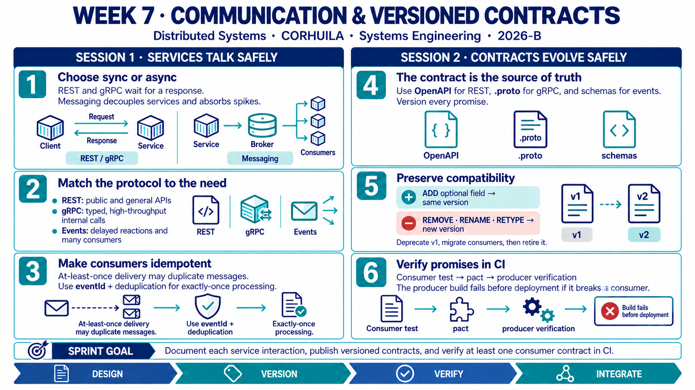

<!-- HU-STATUS TEMPLATE - do NOT remove the <!-- ... --> markers or the table headers.
     Your weekly grade is read AUTOMATICALLY from this file:
       07-week/hu-status/README.md  (inside YOUR fork). English. -->

# Weekly Status - Week 07

<!-- CONFIG-START - must match your profile repo (username/username) CONFIG -->
- FULL_NAME: Maria Celeste Dussan
- GITHUB_USER: CelesteDussan
- TEAM: G1
- SPRINT_GOAL: Organize EduTrack into clear service blocks, define synchronous and asynchronous interactions, and align HU-001, HU-002 and HU-004 with versioned API and event contracts.
<!-- CONFIG-END -->

## 1. User stories worked this week
| HU ID | Title | Status (todo/doing/done) | Evidence (PR or commit URL) |
|---|---|---|---|
| HU-001 | View grades in near real time | doing | [Academic API PR #2](https://github.com/code-corhuila/educk-academic-api/pull/2) · [Notification worker PR #2](https://github.com/code-corhuila/educk-worker/pull/2) |
| HU-002 | Receive absence alerts without duplicates | doing | [Notification worker PR #2](https://github.com/code-corhuila/educk-worker/pull/2) · [Attendance API PR #2](https://github.com/code-corhuila/educk-attendance-api/pull/2) |
| HU-004 | Direct communication with teachers - MVP 1 walking skeleton | done | [Communication portal PR #5](https://github.com/code-corhuila/educk-communication-portal/pull/5) · [Communication DB PR #2](https://github.com/code-corhuila/educk-communication-db/pull/2) |

## 2. My individual contribution
- Worked with the team to organize EduTrack into separate service and repository blocks: gateway, identity, academic, attendance, notifications, communication and shared infrastructure.
- Reviewed which interactions require an immediate REST response and which should use asynchronous RabbitMQ events such as `GradeCreated`, `StudentAbsent` and `MessageCreated`.
- Connected HU-001, HU-002 and HU-004 to the documented OpenAPI contracts, event catalog, service boundaries and official implementation PRs.
- Distinguished the delivered HU-004 MVP 1 walking skeleton from the still-integrating HU-001 and HU-002 flows, avoiding unsupported completion claims.
- Created an English Week 7 learning infographic covering REST, gRPC, messaging, idempotent consumers, contract versioning and consumer-driven contract testing.

## 3. Blockers and risks
- The code and documentation were spread across several repositories, making naming, ownership and implementation status harder to keep synchronized.
- HU-001 and HU-002 cross multiple blocks and still require end-to-end evidence across producers, RabbitMQ, idempotent consumers and the parent-facing result.
- OpenAPI and event specifications exist, but no individual Pact or equivalent consumer-driven contract test was verified for this report.
- At-least-once delivery can create duplicate effects unless every consumer persists and checks a stable `eventId`.

## 4. Plan for next week
- Freeze and publish the v1 REST and event contracts used by each service interaction.
- Add at least one consumer-driven contract test to CI and make the producer build fail on an incompatible response change.
- Validate duplicate delivery for `GradeCreated` and `StudentAbsent`, including deduplication and retry behavior.
- Reconcile the service catalog, repository names, traceability matrix and implementation status in the official documentation.
- Collect individual code or review evidence before marking the remaining stories as done.

## 5. Compliance self-check
- [x] Conventional Commits - `type(scope): summary`
- [ ] Per-environment HU branch + PR to that environment (hu-xxx-dev -> develop, ...)
- [x] Testable acceptance criteria
- [ ] Tests added/updated (unit / integration)
- [ ] DDD / hexagonal boundaries respected (domain has no I/O)
- [x] No secrets; config via environment variables

## 6. Evidence links
- [EduTrack service blocks and responsibilities](https://github.com/code-corhuila/educk-docs/blob/main/09-microservices/service-catalog.md)
- [Synchronous REST and asynchronous messaging patterns](https://github.com/code-corhuila/educk-docs/blob/main/09-microservices/communication-patterns.md)
- [Versioned domain-event catalog](https://github.com/code-corhuila/educk-docs/blob/main/09-microservices/event-catalog.md)
- [OpenAPI contracts by service](https://github.com/code-corhuila/educk-docs/tree/main/07-api/contracts/openapi)
- [HU definitions and acceptance criteria](https://github.com/code-corhuila/educk-docs/blob/main/04-requirements/user-stories.md)
- [Academic API implementation - PR #2](https://github.com/code-corhuila/educk-academic-api/pull/2)
- [Notification worker implementation - PR #2](https://github.com/code-corhuila/educk-worker/pull/2)
- [Communication portal implementation - PR #5](https://github.com/code-corhuila/educk-communication-portal/pull/5)
- [Shared multi-service infrastructure - PR #2](https://github.com/code-corhuila/educk-infra/pull/2)

## 7. Week 7 learning summary - Sessions 1 and 2

**Session 1 - Inter-service communication:** REST and gRPC are synchronous because the caller waits for a response; messaging is asynchronous and decouples producers from consumers. REST is the general choice for public and browser-facing APIs, while gRPC fits typed, high-throughput internal calls. RabbitMQ or Kafka can distribute work or fan one event out to several consumers. Because at-least-once delivery may repeat a message, consumers must use a stable idempotency key such as `eventId` and deduplicate side effects.

**Session 2 - Versioned contracts and contract testing:** OpenAPI, `.proto` files and event schemas are machine-readable promises between independently deployed services. Adding an optional field can remain compatible in the same version; removing, renaming or changing the type of a field requires a new version and a deprecation period. Consumer-driven contract tests publish the consumer's expectations and verify them against the producer in CI before an incompatible change can be deployed.

**Key takeaway:** Select the communication mode per interaction, then protect that interaction with an explicit versioned contract, idempotent processing and automated compatibility checks.

## 8. EduTrack project progress - Week 7

The team advanced from a single MVP view toward explicit service blocks and repositories for the API gateway, identity, academic records, attendance, notifications, communication portals and databases, and shared infrastructure. Official `develop` branches received implementations for several of these blocks, including the academic grade flow, attendance events, notification consumers, communication persistence and portals, routing and Docker Compose infrastructure.

The architecture documents describe synchronous REST queries and asynchronous RabbitMQ events with service-owned data. `GradeCreated`, `StudentAbsent` and `MessageCreated` provide the main integration points. HU-004 is recorded as the delivered MVP 1 communication walking skeleton; HU-001 and HU-002 remain integration work because their complete producer-to-consumer behavior still requires end-to-end and individual evidence.

The next quality step is contract enforcement: keep OpenAPI and event schemas versioned, add consumer-driven checks to CI, and verify that redelivered events cannot create duplicate notifications.
